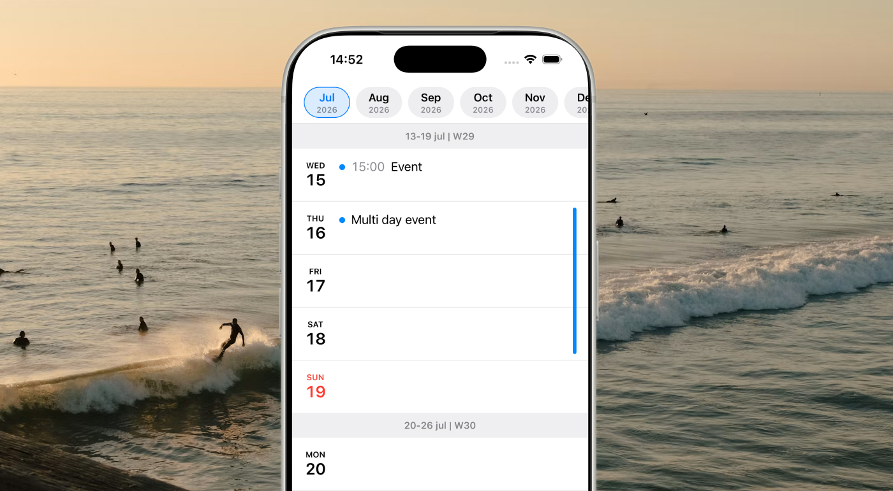

# Daymo

Daymo is a free, open-source calendar for iOS and Android that makes upcoming days and weeks easier to overview at a glance.

## Why Daymo?

Quickly answer questions like "Does anything need my attention this week?" and "Is Friday a good day for that trip?".

Upcoming weeks are displayed in a continuous vertical week view. It is similar to agenda views in other apps, but keeps empty days visible to keep your week easy to overview spatially. 

All day and multi day events is also first class citizens with a minimal design to keep your week easy to scan.

Daymo syncs with the device calendar so no new account is needed and all your existing calendar events are available when you start the app for the first time. The app is free and open source.

## App Installation

App Store: https://apps.apple.com/do/app/daymo-calendar/id6786874221<br>
Google Play: https://play.google.com/store/apps/details?id=io.flown.daymo



## Development

### Requirements

- [Bun](https://bun.sh/) 1.3 or newer
- [Expo SDK 57](https://docs.expo.dev/versions/v57.0.0/)
- Xcode and macOS for iOS development
- Android Studio and the Android SDK for Android development

Daymo uses native calendar APIs and is not intended to run on the web.

### Getting started

```sh
git clone https://github.com/simonbengtsson/daymo.git
cd daymo
bun install
```

Build and run the app on a simulator, emulator, or connected device:

```sh
bun run ios
# or
bun run android
```

These commands generate the native `ios` or `android` directory when needed. Both directories are intentionally ignored because this project uses Expo's Continuous Native Generation workflow.

After the first native build, start Metro for normal JavaScript and TypeScript development:

```sh
bun run start
```

### Validation

Run the project check before opening a pull request:

```sh
bun run check
```

This runs TypeScript in type-checking mode without emitting build output.

## Contributing

Contributions are welcome. Create a branch from `main`, keep changes focused, run `bun run check`, and open a pull request describing the change and how it was verified. Releases will be published to the Google Play Store and App Store as needed.

## Use of Codex

[OpenAI Codex](https://openai.com/codex/) was used as the development assistant for this project. Everything from implementation, troubleshooting and project ideation was assisted by Codex.

## Release builds

Maintainers with signing credentials can prepare a release by:

1. Updating the app version, iOS build number, and Android version code in `app.json`.
2. Regenerating native projects with `bunx expo prebuild` when native configuration has changed (versions for example).
3. Building the Android App Bundle with `bun run build:aab` after installing the maintainer signing keystore -> https://play.google.com/console/u/0/developers/6822011924129869646/app/4974301168795141139/test-and-release
4. Archiving and submitting the iOS app through Xcode.

## License

Daymo is available under the [MIT License](LICENSE).
